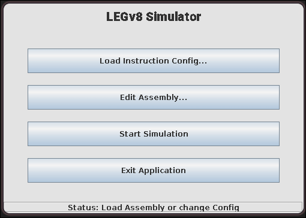
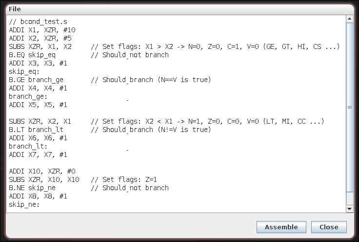
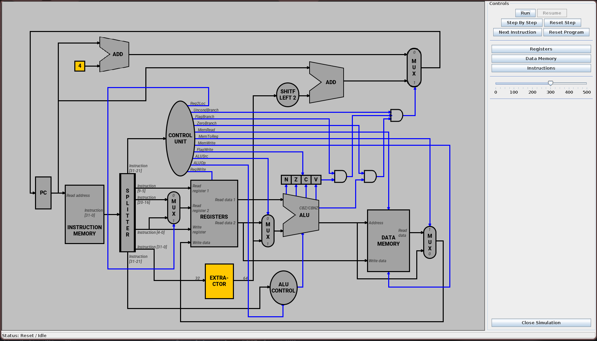

# LEGv8 CPU Simulator

A visual LEGv8 CPU simulator implemented in Java, designed for educational purposes to help understand the datapath and control signals of a simple pipelined processor. Users can write LEGv8 assembly, observe the step-by-step execution on a graphical datapath, and inspect register and memory states.

## Features

*   **Assembly Editor:** Built-in editor to write, open, and save LEGv8 assembly files (`.s`, `.asm`).
*   **Instruction Set Configuration:**
    *   Define LEGv8 instructions, their formats, opcodes, and control signals via a CSV file (`instructions_config.csv`).
    *   Supports R, I, D, B, CB (Conditional Branch & Compare and Branch), and IM (Immediate Move Wide) formats.
*   **Visual Datapath Simulation:**
    *   Graphical representation of the LEGv8 single-cycle datapath.
    *   Highlights active components and buses during each micro-step.
    *   Animates data values flowing through buses.
*   **Execution Control:**
    *   **Run:** Execute the program continuously.
    *   **Pause/Resume:** Pause or resume continuous execution.
    *   **Step-by-step:** Execute one micro-step at a time.
    *   **Next Instruction:** Complete the current instruction and fetch the next.
    *   **Reset:** Reset the simulator (PC, registers, memory) or just the current instruction step.
    *   **Speed Control:** Adjust simulation speed for continuous run mode.
*   **State Inspection:**
    *   **Register View:** Displays the current values of all 32 general-purpose registers (X0-X30, XZR/X31, SP).
    *   **Data Memory View:** Shows the contents of data memory, with an option to specify the address range.
    *   **Instruction Memory View:** Lists loaded instructions with their addresses, disassembly, and bytecode (hex/binary). Highlights the current PC.
*   **Customizable Layout:** The datapath visualization is driven by a JSON configuration file (`datapath_layout.json`), allowing for potential modifications to the visual layout.
*   **Cross-Platform:** Built with Java Swing for the GUI. Build and run scripts provided for Linux/macOS and Windows (unified in a `Makefile`).

## Screenshots

**Main menu**


**Assembly Editor:**


**Datapath View During Simulation:**



## Technologies Used
*   **Java:** Core programming language.
*   **Swing:** For the Graphical User Interface (GUI).
*   **JSON:** For datapath layout configuration (parsed with Jackson libraries).

## Prerequisites
*   **Java Development Kit (JDK):** Version 11 or higher recommended. Make sure `javac` (compiler) and `java` (runtime) are in your system's PATH.
*   **Make:** To use the provided `Makefile`.
    *   **Linux/macOS:** Usually pre-installed or easily installable via package managers (e.g., `sudo apt install build-essential` on Debian/Ubuntu, Xcode Command Line Tools on macOS).
    *   **Windows:** Can be installed via:
        *   [Chocolatey](https://chocolatey.org/): `choco install make`
        *   [MSYS2](https://www.msys2.org/): Install MSYS2 and then `pacman -S make` from the MSYS2 terminal.
        *   Windows Subsystem for Linux (WSL).

## Project Structure
```
├── Makefile              # Build and run script
├── README.md             # This file
├── bin/                  # Compiled .class files and copied resources (created by build)
├── lib/                  # External libraries (e.g., Jackson for JSON if used)
├── resources/
│   ├── config/
│   │   └── instructions_config.csv   # Instruction definitions
│   ├── fonts/
│   │   └── ... (font files)
│   ├── images/
│   │   └── ... (datapath component images)
│   └── layout/
│       └── datapath_layout.json      # Datapath visual layout
└── src/                  # Java source code
    ├── legv8/
    │   ├── assembler/
    │   ├── core/
    │   ├── datapath/
    │   ├── exceptions/
    │   ├── gui/
    │   ├── instructions/
    │   ├── simulator/
    │   ├── storage/
    │   └── util/
    └── Application.java    # Main application entry point
    └── Legv8Simulator.java # Command-line test/utility (if kept)
```
## Getting Started

1.  **Clone the repository:**
    ```bash
    git clone https://github.com/NgTrongDoanh/legv8-simulator.git
    cd legv8-simulator
    ```

2.  **Place Libraries:**
    Make sure `jackson-annotations-3.0-rc3.jar`, `jackson-core-2.19.0-rc2.jar` and `jackson-databind-2.19.0-rc2.jar` are placed in the `lib/` directory.

## Build and Run

The project uses a `Makefile` for building and running.

### Build
To compile the Java source code and copy resources:
```bash
make build
```
This will create a `bin/` directory containing the compiled `.class` files and a copy of the `resources/` directory.

### Run
After a successful build, to run the simulator:
```bash
make run
```
This will launch the main GUI application.

### Clean
To remove the `bin/` directory and other build artifacts:
```bash
make clean
```

### Help
To see available Make targets:
```bash
make help
```

## Configuration

### Instruction Set (`resources/config/instructions_config.csv`)
This CSV file defines the LEGv8 instructions recognized by the simulator. You can modify or add instructions here. The columns are typically:
`Mnemonic,Format,OpcodeID(Bin),RegW,ALUSrc,MemW,MemR,MemToReg,ZeroB,FlagB,UncondB,Reg2Loc,FlagW,ALUOperation(Enum),ALUControlOutput(Bin)`

*   **Mnemonic:** The assembly instruction (e.g., `ADD`, `LDUR`).
*   **Format:** Instruction format (R, I, D, B, C, M).
*   **OpcodeID(Bin):** The binary opcode identifier bits for this instruction.
*   **Control Signals (RegW, ALUSrc, etc.):** 0 or 1 to indicate if the control signal is active.
*   **ALUOperation(Enum):** An internal enum/code used by the ALU control to determine the specific ALU function (e.g., add, sub, and).
*   **ALUControlOutput(Bin):** The 4-bit binary signal sent to the ALU from the ALUControl unit for R-type, or specific operations for other types.

### Datapath Layout (`resources/layout/datapath_layout.json`)
This JSON file describes the components, their positions, assets (images), and connections (buses) for the visual datapath.
*   **`canvasSize`**: Defines the overall dimensions of the datapath drawing area.
*   **`components`**: An array of objects, each defining a datapath component:
    *   `id`: Unique identifier (must match `ComponentID.java` enum).
    *   `asset`: Basename for image files (e.g., "program_counter" leads to `program_counter_active.png` and `program_counter_inactive.png`).
    *   `label`: Text label for the component.
    *   `x`, `y`, `width`, `height`: Position and dimensions.
    *   `connectionPoints`: Defines named points on the component for bus connections.
*   **`buses`**: An array of objects, each defining a bus:
    *   `id`: Unique identifier (must match `BusID.java` enum).
    *   `path`: An array of points defining the bus route. Points can be absolute (x,y) to a component's connection point.
    *   `color`: Color of the bus.
    *   `thickness`: Thickness of the bus line.

## Contributing
Pull requests are welcome. For major changes, please open an issue first to discuss what you would like to change.

Please make sure to update tests as appropriate.